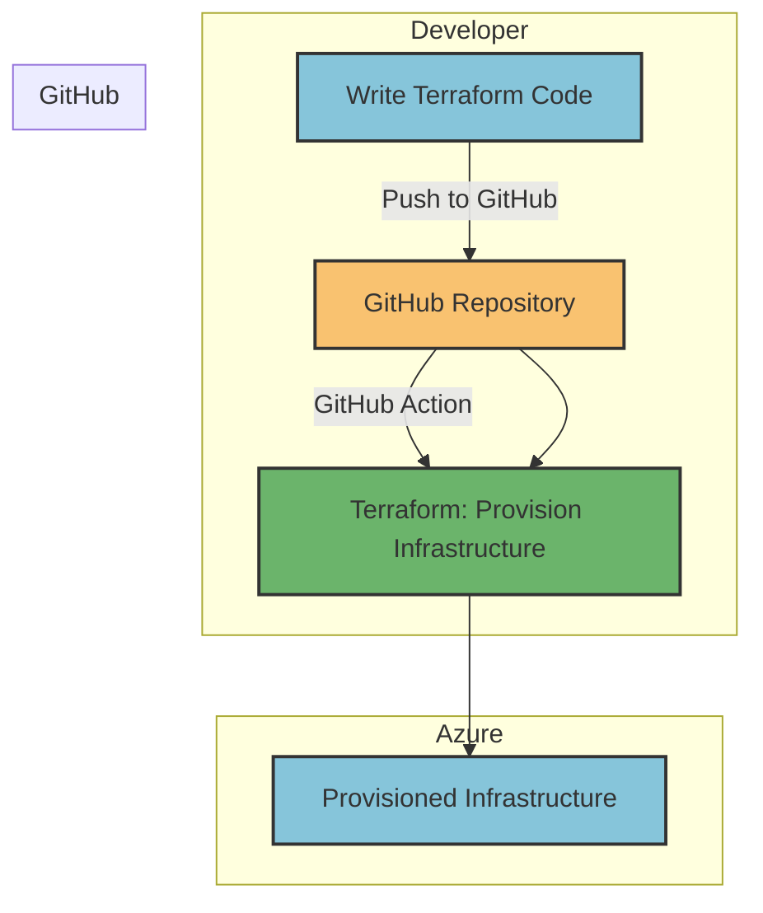
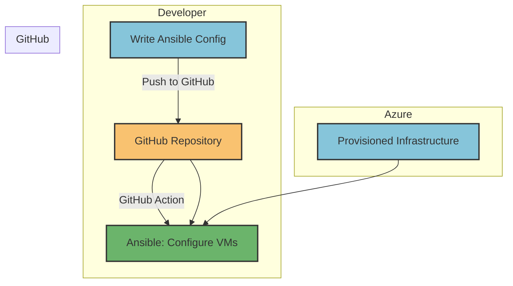

<!-- PROJECT SHIELDS -->
<!--
*** declarations on the bottom of this document
-->
[![License][license-shield]][license-url] [![Contributors][contributors-shield]][contributors-url] [![Issues][issues-shield]][issues-url] [![Forks][forks-shield]][forks-url] [![Stargazers][stars-shield]][stars-url]

<!-- PROJECT LOGO -->
 

   <!--  -->

  <h1 align="center"><strong>Terraform and Ansible Hand In Hand</strong></h1>
  

    🌩️ Terraform and Ansible: Teaming Up for Automated Cloud Magic 🌩️
     
    <a href="https://github.com/ishuar/terraform-ansible/issues"><strong>Report Bug</a></strong> or <a href="https://github.com/ishuar/terraform-ansible/issues"><strong>Request Feature</a></strong>
     
     
  

# Terraform and Ansible hand in hand for Azure Cloud

## Introduction

Terraform and Ansible 🤝 are powerful tools that can work synergistically to provision and configure cloud infrastructure. In this repository, we'll explore how to utilize Terraform for infrastructure provisioning and Ansible for configuration management, all within the context of Microsoft Azure.

## Prerequisites

Before diving into using Terraform and Ansible for your Azure cloud infrastructure, ensure you have the following prerequisites in place:

| Prerequisite                       | Description                                                                                                                                                                                                                                                                                |
|------------------------------------|--------------------------------------------------------------------------------------------------------------------------------------------------------------------------------------------------------------------------------------------------------------------------------------------|
| Azure Account                      | You must have a valid [Azure account](https://azure.com) to create and manage resources on the Azure cloud platform.                                                                                                                                                                       |
| Terraform Installed                | [Install Terraform](https://developer.hashicorp.com/terraform/tutorials/aws-get-started/install-cli) on your local machine. Terraform is an Infrastructure as Code (IaC) tool that enables you to define and manage cloud resources using configuration files.                             |
| Ansible Installed                  | [Install Ansible](https://docs.ansible.com/ansible/latest/installation_guide/intro_installation.html) on your local machine. Ansible is an automation tool that allows you to configure and manage servers.                                                                                |
| Azure CLI Installed                | [Install Azure CLI](https://docs.microsoft.com/en-us/cli/azure/install-azure-cli) to provide command-line access to Azure resources. Essential for both Terraform and Ansible to interact with your Azure account.                                                                         |
| Azure Service Principal            | [Create an Azure service principal](https://docs.microsoft.com/en-us/cli/azure/create-an-azure-service-principal-azure-cli) to authenticate Terraform and Ansible to access your Azure resources. The service principal should have sufficient permissions to create and manage resources. |
| Version Control System (e.g., Git) | A version control system is crucial for managing and collaborating on code changes. If you're not already using one, consider setting up a [Git repository](https://docs.github.com/en/get-started).                                                                                       |

#### Conclusion

Ensuring you have the necessary prerequisites in place is the foundation for successfully integrating Terraform and Ansible for Azure cloud infrastructure provisioning and configuration. With the right tools and a solid understanding of the prerequisites, you'll be well-prepared to leverage the combined power of Terraform and Ansible in your cloud projects.

In the next sections of this guide, we'll delve into creating Azure resources using Terraform, configuring those resources using Ansible, and automating these processes through GitHub Actions. Stay tuned for the continuation of this guide.

## Examples in the Repository

### Terraform Configuration for Linux Web Server with Load Balancer

If you're looking to provision a Linux web server with a load balancer in your Azure environment, we've provided a working example in the `terraform/linux-webserver-with-loadbalancer` directory of this repository. To get started, follow these steps:

1. Navigate to the [terraform/linux-webserver-with-loadbalancer](./terraform/linux-webserver-with-loadbalancer) directory.
2. Refer to the `Readme.md` file in that directory for detailed information on the Terraform configurations, step-by-step instructions, and best practices.
3. Follow the instructions in the `Readme.md` file to deploy the Linux web server and load balancer using Terraform.

### Ansible Playbook for Configuring Web Servers

Once you've successfully provisioned the Linux web servers using Terraform, you can now configure them as web servers hosting a customizable static website. In the `ansible/` directory of this repository, you'll find the `set-up-ubuntu-nginx-webserver.yaml` playbook that automates the configuration process. Here's how to proceed:

1. Navigate to the [ansible/](./ansible) directory.
2. Locate the `set-up-ubuntu-nginx-webserver.yaml` playbook.
3. Open the playbook to explore its contents and understand the configuration steps.
4. Modify the playbook as needed to customize the static website you want to host.
5. Execute the playbook using Ansible to apply the configuration to your provisioned web servers.

Please note that this example playbook demonstrates the power of using Ansible for configuration management. You can adapt and expand this playbook to suit your specific requirements and deploy more complex configurations.

#### Conclusion

By exploring the examples provided in this repository, you can gain hands-on experience with combining Terraform and Ansible for Azure cloud infrastructure provisioning and configuration. These practical examples will help you better understand the concepts and workflows involved, enabling you to apply them effectively in your projects.

If you have any questions or need further assistance, feel free to reach out to me via contact section or create a `Issue` in this repository.

### Automation with GitHub Actions

We understand that local development is an essential part of the process, but once you've mastered your Terraform configurations and Ansible playbooks, it's time to take advantage of automation for seamless deployments. In this repository, we've provided GitHub Actions workflows in the `.github/workflows` directory that enable you to automate the entire process from provisioning to configuration.

#### GitHub Actions Workflows

In the `.github/workflows` directory, you'll find predefined workflows that leverage GitHub Actions to automate the Terraform provisioning and Ansible configuration steps. These workflows ensure consistency, reliability, and efficiency throughout your deployment process.

To utilize these workflows:

1. Navigate to the `.github/workflows` directory.
2. Review the available [reusable workflows](https://docs.github.com/en/actions/using-workflows/reusing-workflows), such as [`ansible-set-up.yaml`](./github/workflows/ansible-set-up.yaml) and [`terraform-infra-set-up.yaml`](./.github/workflows/terraform-infra-set-up.yaml).
3. Customize the workflows as needed to match your environment and preferences.
4. GitHub Actions will trigger these workflows based on specific events, such as `pushes` and `pull request` to the repository.

Please note that these GitHub Actions workflows are designed to eliminate the need for manual intervention during deployments. This means that the steps you previously followed for local development are now automated through GitHub Actions.

-  Infra provisioning can be understood using the below diagram where terraform configurations and `webservers-infra-terraform.yaml` github action are involved.

-  Infra configuration can be understood using the below diagram where ansible configurations and `webservers-config-ansible.yaml` github action are involved.

#### Conclusion

By embracing GitHub Actions workflows available in the `.github/workflows` directory, you can streamline your deployment process, eliminate manual intervention, and ensure efficient provisioning and configuration of your Azure cloud infrastructure. This automation empowers you to focus on refining your Terraform configurations and Ansible playbooks while maintaining confidence in your deployments.

If you're new to GitHub Actions, refer to the [GitHub Actions Documentation](https://docs.github.com/en/actions) for comprehensive guides and best practices.

### Local Development vs. Automation

While the steps outlined earlier in this README were intended for local development and learning purposes, we highly recommend transitioning to using the GitHub Actions workflows for your production deployments. This automated approach enhances consistency, reduces human error, and increases the speed at which you can deploy and manage your Azure resources.

<!-- CONTRIBUTING -->
## Contributing

Contributions are what make the open source community such an amazing place to learn, inspire, and create. Any contributions you make are **greatly appreciated**.

If you have any suggestion that would make this project better, feel free to  fork the repo and create a pull request. You can also simply open an issue with the tag "enhancement" with your suggestion.

**⭐️Don't forget to give the project a star! Thanks again!⭐️**

See [`CONTRIBUTING`](/CONTRIBUTING.md) for more information.

<!-- LICENSE -->
## License

Released under [MIT](/LICENSE) by [@ishuar](https://github.com/ishuar).

<!-- CONTACT -->
## Contact

- 👯 [LinkedIn](https://linkedin.com/in/ishuar)

<a href="#top">Back To Top ⬆️</a>

<!-- MARKDOWN LINKS & IMAGES -->
<!-- https://www.markdownguide.org/basic-syntax/#reference-style-links -->

[contributors-url]: https://github.com/ishuar/terraform-ansible/graphs/contributors
[contributors-shield]: https://img.shields.io/github/contributors/ishuar/terraform-ansible?style=for-the-badge

[forks-url]: https://github.com/ishuar/terraform-ansible/network/members
[forks-shield]: https://img.shields.io/github/forks/ishuar/terraform-ansible?style=for-the-badge

[stars-url]: https://github.com/ishuar/terraform-ansible/stargazers
[stars-shield]: https://img.shields.io/github/stars/ishuar/terraform-ansible?style=for-the-badge

[issues-url]: https://github.com/ishuar/terraform-ansible/issues
[issues-shield]: https://img.shields.io/github/issues/ishuar/terraform-ansible?style=for-the-badge

[license-url]: https://github.com/ishuar/terraform-ansible/blob/main/LICENSE
[license-shield]: https://img.shields.io/github/license/ishuar/terraform-ansible?style=for-the-badge